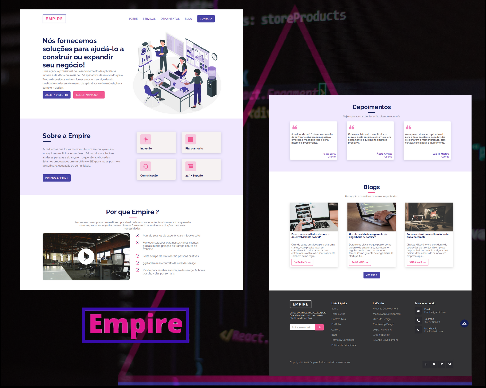

<h1 align="center">
       
</h1>

## 💻 Project

The **Empire** project is a Web application consisting of a website for a company that provides software development services.

<h1 align="center">
    
</h1>

## 🚀 Technologies

- React
- React-icons
- Framer-motion
- Sass
- React-intersection-observer

## ℹ️ How to Execute

- ### **Preconditions**
  - You must have Node.js installed on your computer.
  - You must have Git installed and configured on your computer.
  - Also, you need to have a package manager, either NPM or Yarn.

1. Make a clone of the repository:

```sh
  $ git clone https://github.com/Djaysson/Empire-UI-LandingPage.git
```

2. Application Execution:

```sh
  # Go to the project folder.
  $ cd Empire-UI-LandingPage

  # Installing the project dependencies.
  $ yarn install # or npm install

  # Run the app
  $ yarn start # or npm start
```

Made by Djayson Rodrigues 👋 [Linkedin](https://www.linkedin.com/in/djaysonrodrigues/)
